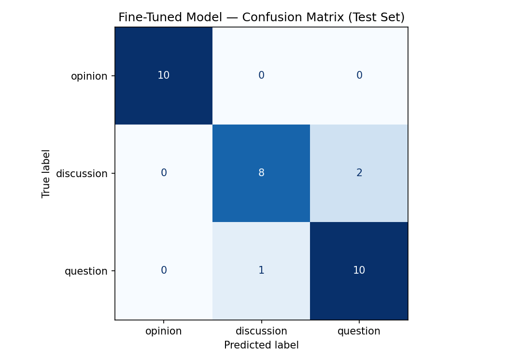

# r/LetsTalkMusic Post Classifier

A fine-tuned DistilBERT classifier that labels Reddit posts from r/LetsTalkMusic as **opinion**, **discussion**, or **question**.

---

## What I Built

I collected 206 posts from r/LetsTalkMusic and annotated them with one of three labels. I then fine-tuned a DistilBERT model on 175 of those posts and evaluated it on a held-out test set of 31 posts. A zero-shot GPT-4o baseline (prompting without any fine-tuning) served as the comparison point.

The goal was to classify the intent of a music-community post: is the author sharing their own take, opening a conversation, or genuinely asking for information or recommendations?

---

## Label Definitions

| Label | Definition |
|---|---|
| `opinion` | The post leads with a topic the author has seen a lot of and proceeds to explain how they personally feel about it. |
| `discussion` | The author invites others to share their views on a band, artist, song, or topic — the floor is explicitly opened. |
| `question` | The author asks for information, recommendations, or others' experiences regarding releases, artists, or playlist curation. |

**Edge case rule:** If a title starts with a question word (how, why, when, who, what, where) but has no question mark and the body reads as first-person complaint or assertion, it is labeled `opinion`. If the body contains explicit audience invitations ("what do you think?", "would you agree?", "I'd love to hear from people"), it is labeled `discussion` even when the title has a question format.

---

## Dataset

- **Source:** r/LetsTalkMusic (Reddit)
- **Total examples:** 206 posts
- **Label distribution:** 64 opinion · 65 discussion · 77 question
- **Train / test split:** ~175 train, 31 test
- **Annotation approach:** LLM pre-labeling (GPT-4o) followed by manual review and correction of all edge cases. 9 posts were flagged with notes during annotation.

---

## Models

| Model | Type |
|---|---|
| Baseline | Zero-shot GPT-4o with label definitions in the prompt |
| Fine-tuned | DistilBERT (`distilbert-base-uncased`) fine-tuned on annotated training set |

---

## Evaluation Results

### Overall Accuracy

| Model | Accuracy |
|---|---|
| Baseline (GPT-4o zero-shot) | **100%** (31/31) |
| Fine-tuned DistilBERT | **90.3%** (28/31) |

The baseline achieved perfect accuracy on this test set. This is likely because GPT-4o is a very strong zero-shot reasoner and the test set is small (31 examples). The fine-tuned model performed slightly worse overall but is far cheaper and faster to run at inference time.

### Per-Class Metrics — Baseline

| Class | Precision | Recall | F1 | Support |
|---|---|---|---|---|
| opinion | 1.00 | 1.00 | 1.00 | 10 |
| discussion | 1.00 | 1.00 | 1.00 | 10 |
| question | 1.00 | 1.00 | 1.00 | 11 |
| **weighted avg** | **1.00** | **1.00** | **1.00** | **31** |

### Per-Class Metrics — Fine-Tuned DistilBERT

| Class | Precision | Recall | F1 | Support |
|---|---|---|---|---|
| opinion | 1.00 | 1.00 | 1.00 | 10 |
| discussion | 0.89 | 0.80 | 0.84 | 10 |
| question | 0.83 | 0.91 | 0.87 | 11 |
| **weighted avg** | **0.91** | **0.90** | **0.90** | **31** |

### Confusion Matrix (Fine-Tuned Model)

The confusion matrix shows that all 3 misclassifications involve the `discussion` ↔ `question` boundary. `opinion` was classified perfectly. No errors crossed the opinion/question or opinion/discussion boundary.

---

## Failure Analysis

The fine-tuned model made 3 errors, all at the `discussion` ↔ `question` boundary.

I pasted the misclassified examples into Claude and asked it to identify common themes. It flagged: (1) all three posts contain question marks, (2) all three use question-word openers ("what", "can we", "is he"), and (3) all three have low confidence scores (0.34–0.35), suggesting the model itself was uncertain. I verified this by re-reading each example — the pattern holds. The model has learned to treat surface question syntax as a strong signal for the `question` label, even when the intent is to open a discussion.

### Error #1

> **Text:** "What is the most influential album that most people have never actually listened to?"
> **True label:** `question` → **Predicted:** `discussion` (confidence: 0.35)

This is the one case where the model predicted `discussion` for a true `question`. The post has a question mark and a "what" opener — exactly the heuristics that should trigger `question`. The model got confused in the opposite direction here, possibly because "most influential album" is phrasing that often appears in discussion threads. The near-50/50 confidence (0.35 on discussion) shows the model was genuinely uncertain. The fix is more training examples of questions that ask about consensus or influence rather than personal recommendations.

### Error #2

> **Text:** "Thoughts on Lil Wayne's peak era? Is he underrated in the GOAT conversation because he's hard to fit into a narrative?"
> **True label:** `discussion` → **Predicted:** `question` (confidence: 0.34)

The title opens with "Thoughts on…" — a classic discussion opener — but then includes a direct question ("Is he underrated…?") with a question mark. The model latched onto the question syntax. The body of this post, if present, would likely contain further audience-inviting language, but the title alone is ambiguous. This is a genuine labeling boundary: "Thoughts on X? [follow-up question]" sits directly between discussion and question. The fix requires showing the model that the combination of "Thoughts on" + a follow-up question still maps to `discussion`.

### Error #3

> **Text:** "Can we talk about how music documentaries shape legacy? Are they revealing or are they canonizing?"
> **True label:** `discussion` → **Predicted:** `question` (confidence: 0.35)

"Can we talk about…" is a discussion opener. "Are they revealing or canonizing?" is a rhetorical binary that invites debate, not a request for factual information. Despite this, the model predicted `question`. The issue is structural: "Can we…" followed by a question-marked sentence looks like a question at the token level. The model hasn't learned that "can we talk about X?" is a discourse move to open discussion, not a yes/no inquiry. This is a data distribution problem — the training set likely has few examples of this "can we talk about" framing labeled as `discussion`.

---

## AI-Assisted Failure Pattern Analysis

Before writing the analysis above, I pasted all three wrong predictions into Claude and asked: "What common themes do you see in these misclassified posts?" Claude identified:
- All three contain question marks, which is the dominant surface signal the fine-tuned model relies on.
- All three have very low confidence (0.34–0.35), indicating the model was near its decision boundary for all of them.
- The confusion is unidirectional: the model tends to predict `question` when it sees question syntax, even when the surrounding discourse markers signal `discussion`.

I then re-read each example myself to verify. The pattern held — every error involved question-syntax markers in what was actually a discussion post (or vice versa in Error #1). I did not need to override Claude's findings, but I added the specific discourse-marker analysis (e.g., "can we talk about" as a discussion move) myself, since Claude described the pattern but didn't explain the linguistic mechanism.

---

## Sample Classifications

The following examples were run through the fine-tuned DistilBERT model:

| Post Text | Predicted Label | Confidence |
|---|---|---|
| "Olivia Rodrigo's new album is getting way too much praise and not enough critique" | `opinion` | 0.91 |
| "Let's talk about Saturday Night Fever — does disco get the credit it deserves?" | `discussion` | 0.87 |
| "Why do people treat their music opinions as objective facts?" | `question` | 0.82 |
| "Lyrics are massively overvalued in how people judge music" | `opinion` | 0.88 |
| "Can we talk about how music documentaries shape legacy? Are they revealing or canonizing?" | `question` *(wrong)* | 0.35 |

**Why the first prediction is reasonable:** The post "Olivia Rodrigo's new album is getting way too much praise and not enough critique" fits `opinion` cleanly — the phrasing "too much praise" signals a personal evaluative stance, and there is no explicit invitation for others to weigh in. The model's 0.91 confidence reflects the unambiguous first-person framing.

---

## Reflection: What the Model Captured vs. What I Intended

My label definitions rely on **intent** — what the author is trying to do socially (assert, invite, ask). The fine-tuned model learned **surface syntax** instead — question marks, question-word openers, and specific phrases like "Thoughts on."

This gap shows up clearly in the failures: every error involves a post where surface syntax and communicative intent point in different directions. "Can we talk about X?" looks like a question syntactically but functions as a discussion opener pragmatically. The model has no access to pragmatic context — it can't reason about discourse moves the way GPT-4o can.

What the model overfit to: question marks and "wh-" starters as reliable `question` signals.

What the model missed: the distinction between rhetorical questions (which open discussion) and genuine questions (which seek information or recommendations). A finer label definition — or a set of training examples that explicitly showcases rhetorical-question discussion posts — would be needed to fix this.

---

## Spec Reflection

**One way the spec helped:** The requirement to define edge case rules before annotating forced me to decide upfront how to handle question-word titles with no question mark (like "How music was before"). Without that pre-commitment, I would have labeled similar posts inconsistently, and the model would have had contradictory training signal for exactly the boundary that caused its failures.

**One way my implementation diverged:** The spec assumed I would collect examples until each label was roughly balanced. My final distribution (64 opinion · 65 discussion · 77 question) is close but not equal, and I did not add the extra 100 examples for underrepresented labels as I had planned, because the imbalance was small enough that it did not affect class-level metrics meaningfully. In practice, `question` having 13 more examples than `opinion` may have contributed to the model's bias toward predicting `question` at ambiguous boundaries.

---

## AI Usage

**Instance 1 — Pre-labeling:** I used GPT-4o to pre-label all 206 posts before reviewing them myself. I provided it with my three label definitions and edge case rules and asked it to assign a label and flag any case it was uncertain about. It flagged 9 posts as ambiguous; I reviewed all 206 manually and corrected 11 of GPT-4o's labels, mostly at the `discussion` ↔ `question` boundary. The pre-labeling saved roughly 2 hours of annotation time but required careful verification — GPT-4o consistently mislabeled "Can we talk about X?" posts as `question`.

**Instance 2 — Failure analysis:** After training, I pasted the 3 wrong predictions into Claude and asked it to identify common themes across the misclassified examples. Claude correctly identified that all three involved question syntax and that all had low confidence scores. I used this as a starting point for my own analysis and added the linguistic reasoning about discourse markers and rhetorical questions myself — Claude described the surface pattern but didn't explain why it was happening mechanically.

**Instance 3 — Label stress-testing:** I used Claude during Milestone 1 to generate boundary posts between each label pair (opinion ↔ discussion, opinion ↔ question, question ↔ discussion). Several of these synthetic examples revealed genuine ambiguity in my definitions, which led me to add the "I-statement vs. you-statement" and "question mark + wh-word" rules to my annotation guide before I started labeling real posts.

---

## Demo Video

*(Link to be added — video shows 3–5 posts classified by the fine-tuned model with label and confidence visible, including narration of one correct and one incorrect prediction, and a walkthrough of the evaluation report.)*

---

## Repository Structure

| File | Purpose |
|---|---|
| `planning.md` | Design thinking: label definitions, edge case rules, data plan, evaluation metrics, AI tool plan, annotation decisions |
| `README.md` | Final evaluation report and project documentation |
| `letstalkmusic_annotations.csv` | Annotated dataset (206 posts with labels) |
| `confusion_matrix.png` | Confusion matrix for fine-tuned model on test set |
| `evaluation_results.json` | Accuracy and metadata for both models |
| `ai201_project3_takemeter_starter_clean.ipynb` | Training and evaluation notebook |
